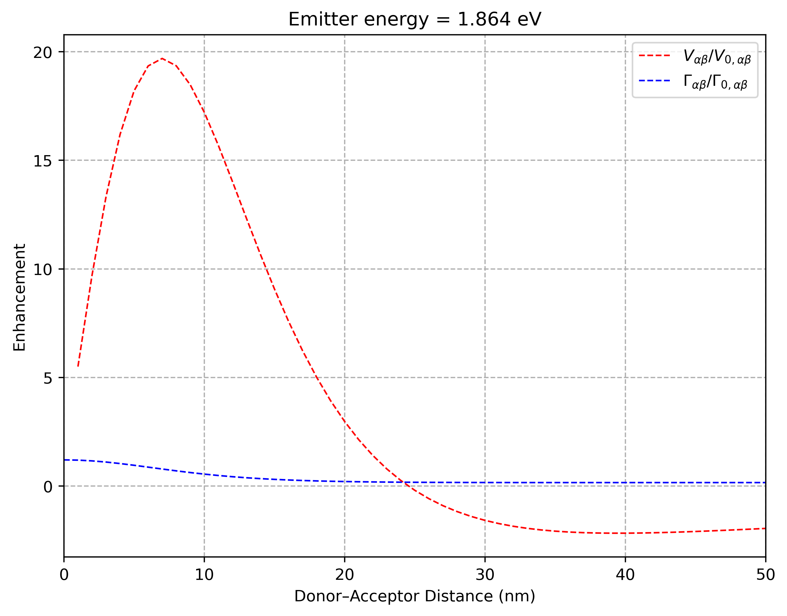
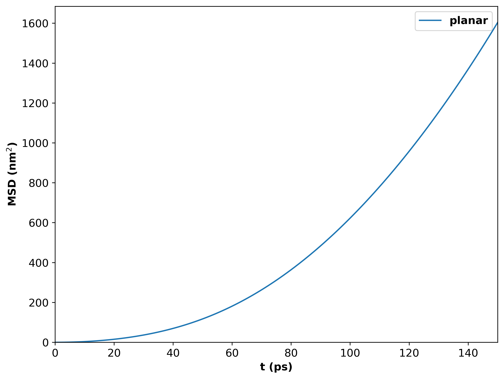
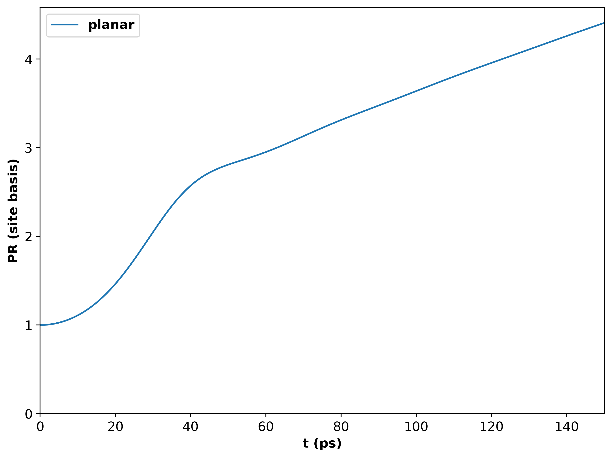

<div align="center">

# MQED-QD

[](#)
[](https://hydra.cc/)
[](#)

A Python package for Macroscopic QED simulations (Dyadic Green’s functions, RET and FE analysis, and open‑system dynamics via Lindblad / NHSE) studying exciton- and plasmon-polaritons in dielectric environments, with Hydra-based configuration and small CLI wrappers for common workflows.

</div>

## Table of Contents

* [Features](#features)
* [Installation](#installation)

  * [Clone](#clone)
  * [Conda/Mamba/Micromamba (recommended)](#condamambamicromamba-recommended)
  * [Pip only](#pip-only)
  * [MPI notes (optional)](#mpi-notes-optional)
* [Quick Start](#quick-start)

  * [Console commands](#console-commands)
  * [Examples](#examples)
* [Configuration (Hydra)](#configuration-hydra)
* [Project Layout](#project-layout)
* [Troubleshooting](#troubleshooting)
* [Documentation](#documentation)
* [License](#license)
* [Third‑party notices](#third-party-notices)

---

## Features

* Dyadic Green’s function simulations.
* Resonance energy transfer (RET) and field enhancement (FE) analysis.
* Lindblad and non‑Hermitian skin effect (NHSE) dynamics.
* Disorder sweeps (single process or MPI, will be implemented in the future).
* Plotting utilities for MSD and RMSD.
* Reproducible runs via Hydra configs and on‑disk caching.

---

## Installation

### Clone

```bash
# clone project
git clone https://github.com/MQED-transport/Macroscopic-Quantum-Electrodynamics.git
cd MacroscopicQED
```

### Conda/Mamba/Micromamba (recommended)

```bash
# choose one of: conda | mamba | micromamba
conda env create -f environment.yaml     # create environment
conda activate mqed                      # activate environment
pip install -e .                         # install as editable package
```

### Pip only

```bash
python -m venv .venv && source .venv/bin/activate
pip install -e .                         # install package
```

<!-- ### MPI notes (optional)

To use the MPI‑based disorder sweeps you need an MPI implementation and `mpi4py` inside the same Python env.

```bash
# Install an MPI runtime first (OpenMPI or MPICH), then:
pip install mpi4py
# quick check
mpirun --version
``` -->

> **Tip:** If system MPI headers are unavailable on your machine, install via your package manager (e.g. `brew install open-mpi`, `apt install libopenmpi-dev openmpi-bin`).

---

## Quick Start

### Console commands

This package installs the following command‑line tools (from `setup.py` entry points):

| Command                   | What it does                                          |
| --------------------------| ------------------------------------------------------|
| `mqed_GF_Sommerfeld`      | Run Dyadic Green’s function simulation on planar.     |
| `mqed_RET`                | Run RET analysis                                      |
| `mqed_FE`                 | Run Field Enhancement analysis                        |   
| `mqed_lindblad`           | Time evolution with Lindblad dynamics                 |
| `mqed_nhse`               | Time evolution with NHSE model                        |
| `mqed_plot_msd`           | Plot mean‑squared displacement from results           |
| `mqed_plot_sqrt_msd`      | Plot square‑root MSD from results                     |
| `mqed_BEM_compute_peff`   | Compute the effective dipole momentum intensity       |
| `mqed_BEM_reconstruct_GF` | Reconstruct dyadic GF from BEM simulation             |
| `mqed_plot_IPR`           | Plot Inverse Participation Ratio (IPR)                |
| `mqed_plot_PR`            | Plot Participation Ratio(PR)                          |
| `mqed_BEM_compare_silver` | Compare BEM and Fresnel results for a silver planar interface |

> All commands are configured via Hydra using YAML files under `configs/`. You can edit those files or override any key from the CLI.

### Examples

Run a **Dyadic Green's function simulation on planar surface** with defaults:

```bash
mqed_GF_Sommerfeld
```

Override parameters inline (Hydra style):

```bash
mqed_GF_Sommerfeld simulation.energy_eV=1.864
```
If you want to simulate multiple frequencies, you can choose List or Dict input:
```bash
mqed_GF_Sommerfeld simulation.energy_eV.min=1.0 simulation.energy_eV.max=2.0 simulation.energy_eV.points=11
# This will simulate 11 energy sources between (1.0, 1.1, 1.2, ... ,2.0 ) eV
```
or:
```bash
mqed_GF_Sommerfeld simulation.energy_eV=[1.0,1.5,2.0]
#This will simulate 3 energy points as (1.0,1.5,2.0) eV
```
You can also change other simulation parameters in the `configs/Dyadic_GF/GF_Sommerfeld.yaml`:
```bash
    position:
         zD: 2.0e-9  # The height of donor at z-axis
         zD_nm: 2    # Key for name
         zA: 2.0e-9  # The height of acceptor at z-axis, default same height as donor.
         Rx_nm:      # Range of horizontal distances between donor and acceptor
           start: 1.0
           stop: 500.0
           points: 501  # Gives points 1, 2, 3, ..., 500 (total 501 points).
output:
    filename: "result_${simulation.material}_${simulation.position.zD_nm}_nm.hdf5" 
    #Or your own file name.
```
<!-- The output file will be saved to outputs/Dyadic_GF_analytical/%%Year-Month-Day/%%Hour-Min-S/.. -->
After simulation, either in terminal or in the `outputs/Dyadic_GF_Sommerfeld/.../Dyadic_GF_Sommerfeld.log` you will see:
```bash
2025-10-24 11:40:02.818 | SUCCESS  | mqed.Dyadic_GF.main:run_simulation:114 - Simulation complete. Output saved to: /.../MacroscopicQED/outputs/Dyadic_GF_Sommerfeld/Y-M-D/H-M-S/YOUR_NAME.hdf5

```
For post-process (Simulate QED or RET), the default path of Green's function is: `/data/GF_cache/result_Ag_2_nm_latest.hdf5`

So you can create a subdirectory `data/GF_cache/` and copy-paste the hdf5 file from the path `/.../MacroscopicQED/outputs/Dyadic_GF_Sommerfeld/Y-M-D/H-M-S/YOUR_NAME.hdf5`.

**Lindblad dynamics:**

```bash
mqed_lindblad simulation.t_ps.start=0.0 simulation.t_ps.stop=150.0 simulation.t_ps.output_step=2e-3
```
You can also change the config files directly in `configs/Lindblad/quantum_dynamics.yaml` :
```bash
greens:
  h5_path: ${oc.env:MQED_ROOT,${oc.env:PWD}}/data/GF_cache/YOUR_NAME.hdf5 # update as needed


# Simulation controls
simulation:
# time grid in picoseconds
  t_ps:
    start: 0.0
    stop: 150.0
    output_step: 5e-3


# system
  Nmol: 100 # number of sites
  d_nm: 3.0 # lattice spacing (nm)


# dipoles / orientation
  mu_D_debye: 3.8
  mu_A_debye: 3.8
  theta_deg: 90.0
  phi_deg: magic # or a number
  mode: stationary # or 'disorder'
```
The program will read Green's function data from `/data/GF_cache/YOUR_NAME.hdf5` for calculating the dipole-dipole interaction matrix. You can also override the path for a specific run from the command line:
```bash
mqed_lindblad greens.h5_path=YOUR_PATH
```
Here the path directly comes from the absolute path after simulation `/YOUR_PATH/YOUR_NAME.hdf5` as mentioned in Dyadic Green's function simulation. Or you can manually overwrite the yaml file in `configs/Lindblad/quantum_dynamics.yaml` file.

**NHSE dynamics:**
The equivalent **Non-Hermitian Schrödinger equation (NHSE)** is implemented here and matches the Lindblad result. **NHSE is recommended for large simulations** because it is much faster than evolving the full density matrix.
You can overwrite the simulation parameter as:
```bash
mqed_nhse simulation.t_ps.start=0.0 simulation.t_ps.stop=100.0 simulation.t_ps.output_step=2e-3
```
You can also change the config files directly in `configs/Lindblad/quantum_dynamics.yaml`.
```bash
simulation:
# time grid in picoseconds
  t_ps:
    start: 0.0
    stop: 150.0
    output_step: 5e-3


# system
  Nmol: 100 # number of sites
  d_nm: 3.0 # lattice spacing (nm)


# dipoles / orientation
  mu_D_debye: 3.8
  mu_A_debye: 3.8
  theta_deg: 90.0
  phi_deg: magic # or a number
  mode: stationary # or 'disorder'
  # disorder_sigma_phi_deg: 15.0 # uncomment for disordered orientations
```

Disorder sweep (multi process):

```bash
mqed_nhse_disorder simulation.disorder_sigma_phi_deg=8.0 initial_state.site_index=51
# Give the std of azimuthal angle as 8.0 and the initial excitation at the middle of 100 molecules.
```

Disorder sweep with MPI (8 ranks):
Not tested yet.
<!-- ```bash
mpirun -n 8 mqed_nhse_disorder disorder.n_samples=400
``` -->

Plot MSD and RMSD:

```bash
mqed_plot_msd 
mqed_plot_sqrt_msd 
```
The `configs/plots/sqrt_msd.yaml` and `configs/plots/msd.yaml` are configure file for **root mean square displacement(RMSD)** and **mean square displacement(MSD)**:
```bash
curves:
  - label: "Magic-Angle"
    use_latest_glob: "${oc.env:MQED_ROOT,${oc.env:PWD}}/data/QDyn_cache/YOUR_NAME.hdf5"  
    style: "-"         # matplotlib line format
    lw: 1.5
  - label: "z-axis"
    use_latest_glob: "${oc.env:MQED_ROOT,${oc.env:PWD}}/data/QDyn_cache/YOUR_NAME.hdf5" 
    style: "-"         # e.g., "C1-"
    lw: 1.5
```
This part gives the curve you want to plot, `use_latest_glob` gives the path of the file, `label` gives the label in the final plot, `lw` is the line-width parameter from plot, `style` is the line style. The users can change the parameter as they prefer, see: https://matplotlib.org/stable/gallery/lines_bars_and_markers/linestyles.html for line style. 

If users want to plot single or multiple lines, they can adapt the template below.
```bash
curves:
  - label: "YOUR LABEL"
    use_latest_glob: "YOUR PATH"  
    style: "YOUR STYLE"         # matplotlib line format
    lw: 1.5
```

Single-curve example.

```bash
curves:
  - label: "YOUR LABEL"
    use_latest_glob: "YOUR PATH"  
    style: "-"         # matplotlib line format
    lw: 1.5
  - label: "YOUR LABEL"
    use_latest_glob: "YOUR PATH" 
    style: "-"         # e.g., "C1-"
    lw: 1.5
  - label: "YOUR LABEL"
    use_latest_glob: "YOUR PATH" 
    style: "YOUR STYLE"         # e.g., "C1-"
    lw: 1.5
```

Multiple-curve example.

The plot settings can also be changed by users' preferences: (See matplotlib documentation for instruction: https://matplotlib.org/stable/users/index)
```bash
plot_settings:
  save_plot: true
  filename: "YOUR_NAME.png"
  dpi: 400
  show: false
  tight_layout: true
  grid: true
  legend: true
  figsize: [7.5, 5.0]

  # x selection (time). Choose one: x_range_ps or x_index_range
  x_range_ps: [0.0, 150.0]   # in picoseconds
  # x_index_range: [0, 500]

  # axis labels, scales, limits
  xlabel: "t (ps)"            # or "t (s)" if you keep in s
  ylabel: "$\\Delta x$ (nm)"
  title: "Silver; Middle Excitation"
  xscale: linear             # or "log"
  yscale: linear
  xlim: null
  ylim: null

  # optional multiply time axis (e.g., to show ×10^-10 s visually):
  x_scale_factor: 1.0        # keep 1.0 if you already saved 't_ps' in seconds; use 1e-12 to convert ps→s
  lw: 1.5
```


---

## Configuration (Hydra)

* Base config directory: `configs/`
* Notable groups:

  * `configs/Lindblad/` — quantum dynamics solver settings, user can change simulation method (`Lindblad`,`NonHermitian`), evaluation time steps, intermolecular distance(`d_nm`), dipole orientations(`theta_deg`, `phi_deg`, dipole strength of donor and acceptor.). The stationary orientation simulation is controlled by 'quantum_dynamics.yaml' and disorder-orientation simulation is controlled by 'quantum_dynamics_disorder.yaml'. 

  -Warning: The number of molecules (`Nmol`) times the intermolecular distance (`d_nm`) must be less than the Dyadic Green's function simulated horizontal distance. If the Green's function simulates `Rx_nm` with 501 points from 0.0 to 500 nm (`start=0.0, stop=500.0, points=501`) but you set 100 molecules (`Nmol=100`) spaced 6 nm apart (`d_nm=6.0`), the program will **abort** because 100*6 = 600 >= 500.
  * `configs/Dyadic_GF/` — geometry/material settings for Dyadic Green's function simulation on planar surface. User can change the dipole source frequency as **single value**, **dictionary of a range of values** or **list of some values** for multi-frequency simulation. The position is the **z-axis height** of donor and acceptor. `Rx_nm` is the *horizontal distance* between donor and acceptor. For new materials, fit a dielectric function and add it to the Excel sheet or supply a new .xlsx file.
  * `configs/analysis/` — RET and plotting parameters. User can change the parameter of donor and acceptor to evaluate the system of interest. Plot-setting parts can be customized by user's preference with the reference of matplotlib.
  * `configs/plots/`: `msd.yaml`, `sqrt_msd.yaml` - The two plot settings for the **mean square displacement (MSD)** or **root mean square displacement (RMSD)**. User can change the part of `curves` to customize the curves of interest with corresponding labels and data path. The plot settings can also be customized by user's preference.

Override any key from the CLI:

```bash
mqed_lindblad +experiment=my_note simulation.t_ps.stop=10.0 simulation.t_ps.output_step=1e-3
```

Hydra organizes outputs under `outputs/` and keeps copies of the used configs for reproducibility. Heavy intermediates may be cached under `data/`.

---

## Project Layout

```
MacroscopicQED/
├─ configs/                 # Hydra configs (Dyadic_GF, Lindblad, analysis, plotting)
├─ data/                    # caches (e.g., GF_cache, QDyn_cache)
├─ mqed/                    # package source
│  ├─ Dyadic_GF/            # Implementation of Fresnel/Sommerfeld integrals for planar systems.
│  ├─ Lindblad/             # Implementation of standard Lindblad equation and non-Schrödinger equation.
│  ├─ analysis/             # Calculate and plot FE, RET.
│  ├─ plotting/             # Plot MSD, IPR, RMSD, PR 
│  ├─ BEM/                  # Run Boundary Element Method(BEM) for electric field simulation.
│  └─ utils/                # Tools for different programs, such as building dipole unit direction, process hdf5 file.
├─ outputs/                 # run outputs (created at runtime)
├─ environment.yaml         # environment specification
├─ pyproject.toml           # build metadata
└─ setup.py                 # entry points and packaging
```

---

## Troubleshooting

* **Command not found** after install: make sure the env is activated and `pip install -e .` completed without errors.
* **MPI errors**: verify `mpirun` exists on PATH and `mpi4py` is installed in the active env.
* **Missing config**: ensure the specified YAML exists under `configs/` or list available options in that folder.
* **Plot scripts**: check that `curves` points to a completed run directory containing the expected logs/data.
* **FileNotFoundError**: check the file paths for specific program.

---

## Beta Test:
* **Prerequisite:** Install the package as introduced in **Installation**.
* **Step1:** After installing the package, run `mqed_GF_Sommerfeld simulation.energy_eV=1.864` in the terminal; it will generate `Fresnel_GF_planar_Ag_height_8nm.hdf5` under `outputs/Dyadic_GF_Sommerfeld/Y-M-D/H-M-S/`. Create `data/GF_cache` under the project root, copy the HDF5 there, and **rename it** to `Fresnel_GF_planar_Ag_height_8nm_665nm.hdf5` (height 8 nm, Ag planar, 665 nm photon).
The relevant configs under `configs/Dyadic_GF/GF_Sommerfeld.yaml` are:
```bash
material:
  source_type: excel
  constant_value: 9.0+0.0j
  excel_config:
    filepath: DielectricFunction/dielectric function.xlsx
    sheet_name: Ag_BEM
simulation:
  material: Ag
  spectral_param: energy_eV
  energy_eV: 1.864
  wavelength_nm:
    min: 500.0
    max: 500.0
    points: 1
  position:
    zD: 8.0e-09
    zD_nm: 8
    zA: 8.0e-09
    Rx_nm:
      start: 0.0
      stop: 300.0
      points: 301
output:
  filename: Fresnel_GF_planar_${simulation.material}_height_${simulation.position.zD_nm}nm.hdf5
```
We provided the result in the `Beta_Test/GF_Sommerfeld` subdirectory for reference.
* **Step2:** Run `mqed_FE` in the terminal; it will generate `enhancement_magic_angle_1.864eV.png` under `outputs/FE/Y-M-D/H-M-S/`. This is the field enhancement for a dipole at 1.864 eV with both dipoles at the magic angle (arccos(1/√3)). The x-axis is the horizontal donor–acceptor distance. You should get the same result as `enhancement_magic_angle_height_8nm_1.864eV.png` in `Beta_Test/FE`.
The reference configs under `configs/analysis/FE.yaml`is:
```bash
input_file: ${oc.env:MQED_ROOT,${hydra:runtime.cwd}}/data/GF_cache/Fresnel_GF_planar_Ag_height_8nm_665nm.hdf5 # 

orientations:
  donor:    { theta_deg: 90.0, phi_deg: "magic" }
  acceptor: { theta_deg: 90.0, phi_deg: "magic" }

plot_settings:
  save_plot: true
  dpi: 400

  # choose x-range by value or by indices, not both  
  x_range_nm: [0.0,100.0] #-> masks points where 1 ≤ Rx_nm ≤ 100
  # x_index_range: [0, 9] #-> masks first 10 points (index 0 to 9)

  components: ["real", "imag"]    # options: ["real"], ["imag"], ["real","imag"]
  # Text & style
  xlabel: "Donor–Acceptor Distance (nm)"
  ylabel: "Enhancement"
  title_template: "Emitter energy = {energy:.3f} eV"
  legend:
    real_label: "$V_{\\alpha\\beta}/ V_{0,\\alpha\\beta}$"
    imag_label: "$\\Gamma_{\\alpha\\beta}/ \\Gamma_{0,\\alpha\\beta}$"
  
  lw: 1
  real_style: "r--"
  imag_style: "b--"

  xscale: linear      # or "log"
  yscale: linear      # or "log"

  # Optional axis limits (override selection if you want)
  xlim: [0, 50]  # e.g., [0, 500]
  ylim: null  # e.g., [0, 10]
  filename_prefix: "enhancement_magic_angle"
  grid: true
```
Here is the reference plot for this step:
  <p align="center">
    
  </p>

* **Step3:** Run `mqed_nhse` in the terminal; it will generate `Fresnel_silver_planar_665nm_N30.hdf5` under `outputs/NonHermitian/Y-M-D/H-M-S/`. This is the quantum dynamics of 30 z-oriented molecules at 665 nm (1.864 eV) with dipole 3.8 D; nearest-neighbor approximation is off (`coupling_limit.enable=false`). For mid-chain excitation set `initial_state.site_index` to `N/2`. Copy the HDF5 to `data/QDyn_cache/intermol_8nm` for reuse.

The relevant configs under `configs/Lindblad/quantum_dynamics_nhse.yaml` are: 
```bash
greens:
  h5_path: ${oc.env:MQED_ROOT,${hydra:runtime.cwd}}/data/GF_cache/Fresnel_GF_planar_Ag_height_8nm_665nm.hdf5 # update as needed

#Material information
material:
  name: silver
  geometry: planar # or 'sphere', 'planar', match with your simulation to avoid confusion.

observables:
  - name: X_shift
    kind: operator

  - name: X_shift2
    kind: operator

  - name: IPR_site
    kind: callable
    params:
      Nmol: ${simulation.Nmol}    # pass through from your sim config

  # # Optionally: one or many site populations
  # - name: pop_site
  #   kind: operator
  #   params:
  #     site: 1                     # 1-based site index (your code uses +1 internally)

  # Add more site populations by repeating the item:
  # - { name: pop_site, kind: operator, params: { site: 10 } }
# Simulation controls
simulation:
# time grid in picoseconds
  t_ps:
    start: 0.0
    stop: 150.0
    output_step: 5e-3

  coupling_limit:
    enable: false
    V_hop_radius: 1
    keep_V_on_site: false
    Gamma_rule: leave # "leave" | "same_as_V" | "diagonal_only" | "limit_by_hops"
    Gamma_hop_radius: None
    keep_Gamma_on_site: true

# system
  Nmol: 30 # number of sites
  d_nm: 8.0 # lattice spacing (nm)

#emitter frequency
  lambda_nm: 665        # wavelength of emitter in nm

# Green's function data simulation method
  gf_method: Fresnel  # 'BEM' or 'Fresnel'


# dipoles / orientation
  mu_D_debye: 3.8
  mu_A_debye: 3.8
  theta_deg: 0.0
  phi_deg: 0.0 # or a number
  mode: stationary # or 'disorder'
  # disorder_sigma_phi_deg: 15.0 # uncomment for disordered orientations


# Initial condition
initial_state:
  site_index: 1 # start the exciton at site |1>


# Solver selection
solver:
  method: NonHermitian # 'Lindblad' or 'NonHermitian'


  # Output file (goes under Hydra's run dir)
output:
  filename: ${simulation.gf_method}_${material.name}_${material.geometry}_${simulation.lambda_nm}nm_N${simulation.Nmol}.hdf5
```
The result is under `Beta_Test/Qdyn/Fresnel_silver_planar_665nm_N30/hdf5` as reference.

**Step4** Run `mqed_plot_msd`; this command generates Mean Square Displacement (MSD) under `outputs/plot_msd/Y-M-D/H-M-S/`. You can modify the filename as needed. The relevant config in `configs/plots/msd.yaml` is:
```bash
  - label: "planar"
    use_latest_glob: "${oc.env:MQED_ROOT,${hydra:runtime.cwd}}/data/QDyn_cache/intermol_8nm/Fresnel_silver_planar_665nm_N30.hdf5"  # or using "outputs/Lindblad/.../qdyn_result.hdft"
    style: "-"         # matplotlib line format
    lw: 1.5
```
If you want to compare multiple plots, copy the same format and change the data resource in `use_latest_glob`. The reference plot is:
  <p align="center">
    
  </p>

If user wants to change the plot setting, like fontsize, label size etc, modify directly in the yaml file.

**Step5** Run `mqed_plot_PR`; this command generates Participation Ratio (PR) under `outputs/plot_msd/Y-M-D/H-M-S/`. You can modify the filename similarly as in Step 4. The relevant config in `configs/plots/pr.yaml` is: 
```bash
  - label: "planar"
    use_latest_glob: "${oc.env:MQED_ROOT,${hydra:runtime.cwd}}/data/QDyn_cache/intermol_8nm/Fresnel_silver_planar_665nm_N30.hdf5"  # or using "outputs/Lindblad/.../qdyn_result.hdft"
    style: "-"         # matplotlib line format
    lw: 1.5
```
If you want to compare multiple plots, copy the same format and change the data resource in `use_latest_glob` as introduced in Step 4. The reference plot is:
  <p align="center">
    
  </p>

User can modify the plot settings same as in Step 4. 

<!-- * **Step3:** Run `mqed_nhse initial_state.site_index=51` in the terminal, it will generate `silver_stationary_latest.hdf5` file under subdirectory `outputs/Lindblad/Y-M-D/H-M-S/`. This result represents the quantum dynamics of molecular aggregate aligned on the silver surface with their azimuthal angle at magic angle. Copy-paste the`silver_stationary_latest.hdf5` file into subdirectory `data/QDyn_cache/`(**create this subdirectory first**) without rename the file.

* **Step4** Run multiple different commands:

```bash
mqed_nhse_disorder simulation.disorder_sigma_phi_deg=10
mqed_nhse_disorder simulation.disorder_sigma_phi_deg=30
mqed_nhse_disorder simulation.disorder_sigma_phi_deg=50
```

After those commands, there will be multiple files name as `silver_sigma${disorder_sigma_phi_deg}_avg_latest.hdf5` (The **disorder_sigma_phi_deg** is the value of your input, i.e, **3,10,30,50**)generated under the subdirectories `outputs/NHSE/Y-M-D/H-M-S/`. The file path will show up in the terminal or you can find them under the file `outputs/NHSE/Y-M-D/H-M-S/NHSE_disorder.log`. Copy-paste those `silver_sigma${disorder_sigma_phi_deg}_avg_latest.hdf5` into subdirectory `data/QDyn_cache/`.
* **Step5:** After **Step4**, you should have `silver_stationary_latest.hdf5` and multiple `silver_sigma${disorder_sigma_phi_deg}_avg_latest.hdf5` files under the `data/QDyn_cache/`. Make sure you have following `curves` part in the `configs/plots/sqrt_msd.yaml`:
 
```bash
curves:
  - label: "Magic-Angle"
    use_latest_glob: "${oc.env:MQED_ROOT,${oc.env:PWD}}/data/QDyn_cache/silver_stationary_latest.hdf5"  # or using "outputs/Lindblad/.../qdyn_result.hdft"
    style: "-"         # matplotlib line format
    lw: 1.5
  - label: "σ=10"
    use_latest_glob: "${oc.env:MQED_ROOT,${oc.env:PWD}}/data/QDyn_cache/silver_sigma10_avg_latest.hdf5" # or using "outputs/NHSE_disorder/.../qdyn_disorder_avg.hdft"
    style: "-"         # e.g., "C1-"
    lw: 1.5
  - label: "σ=30"
    use_latest_glob: "${oc.env:MQED_ROOT,${oc.env:PWD}}/data/QDyn_cache/silver_sigma30_avg_latest.hdf5" # or using "outputs/NHSE_disorder/.../qdyn_disorder_avg.hdft"
    style: "-"         # e.g., "C1-"
    lw: 1.5
  - label: "σ=50"
    use_latest_glob: "${oc.env:MQED_ROOT,${oc.env:PWD}}/data/QDyn_cache/silver_sigma50_avg_latest.hdf5" # or using "outputs/NHSE_disorder/.../qdyn_disorder_avg.hdft"
    style: "-"         # e.g., "C1-"
    lw: 1.5
```

Run `mqed_plot_sqrt_msd` and you should get a file `silver_middle_sqrt_msd.png` under the subdirectory `outputs/plot_sqrt_msd/Y-M-D/H-M-S/`. You should get the same result under the `Beta_Test/silver_middle_sqrt_msd.png`.

Here is the reference of the figure:
  <p align="center">
    
  </p> -->

---

## Documentation

Sphinx docs are included. Build locally:

```bash
cd docs
make html  # output in docs/build/html
```

Open `docs/build/html/index.html` in a browser. (You can also host these on Read the Docs or GitHub Pages later.)

---

## License

License file is not yet included. Choose a license (MIT, BSD‑3‑Clause, or Apache‑2.0 are common), add a `LICENSE` file at the repository root, and update the badge above.

---

## Third‑party notices

At present this repository does **not** vendor code from third‑party projects. If you later copy/adapt external source files, list each project and include its license text here or in a `third_party_licenses/` folder. Depending only on libraries via pip/conda does not typically require reproducing their licenses here.
