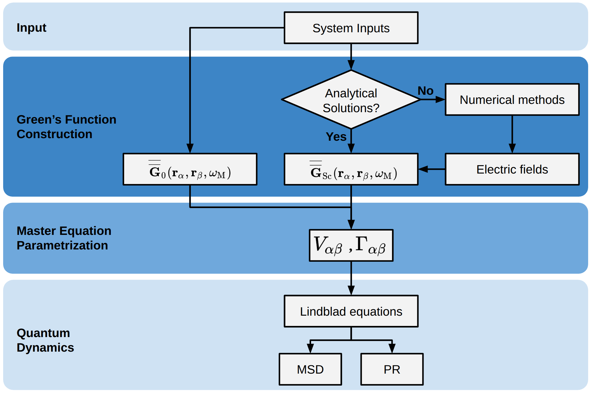

MQED-QD Documentation
=====================

**MQED-QD** is a Python toolkit for simulating exciton-polariton transport
near plasmonic interfaces using macroscopic quantum electrodynamics.

Key Features
------------

- Dyadic Green's functions via Sommerfeld integrals
- Resonance energy transfer (RET) and field enhancement (FE) analysis
- Open-system dynamics: Lindblad master equation & NHSE
- Boundary Element Method (BEM) for arbitrary geometries
- Hydra-based configuration for reproducible workflows

.. toctree::
   :maxdepth: 1
   :caption: Getting Started

   installation
   getting-started

.. toctree::
   :maxdepth: 2
   :caption: Tutorials

   tutorials/index

.. toctree::
   :maxdepth: 1
   :caption: Theory

   theory/two_layer
   theory/RET

.. toctree::
   :maxdepth: 1
   :caption: Reference

   configuration
   api/index